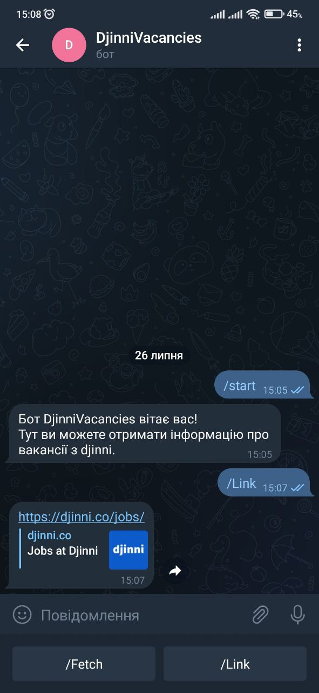
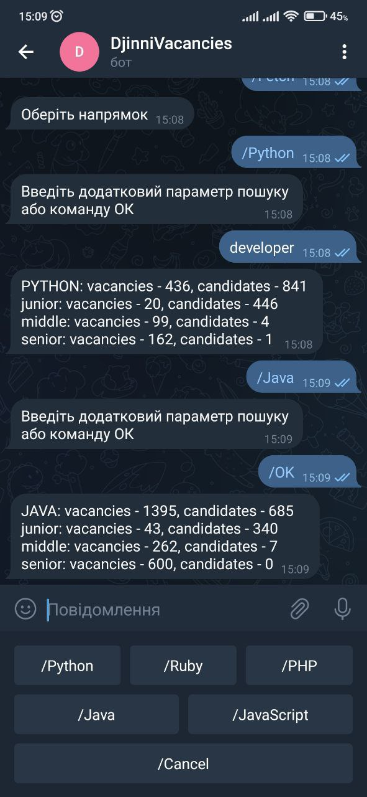

# Project name
Djinni Vacancies

# General info
Telegram bot that scrapes Djinni for number of vacancies and candidates

# Technologies
* python 3
* aiogram
* beautifulsoup

# Setup
To run the project install libraries specified in requirements.txt. 
Enter relevant data to bot_run_example.bat

# Status
Project is: in progress
